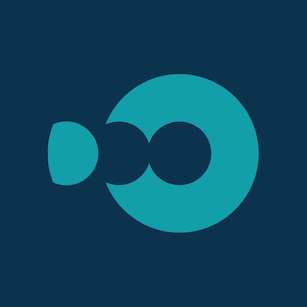

# Dooza Dynamic NFT Factory

**Welcome to the Dooza NFT Factory**

# TO RUN

dfx deploy --argument "(
principal\"$(dfx identity get-principal)\",
record {
logo = record {
logo_type = \"image/png\";
data = \"./src/doocoin_backend/images/nft-logo.png\";
};
name = \"Doo Dynamic NFT Factory\";
symbol = \"DOO\";
maxLimit = 1000;
}
)" doocoin_backend

# IC

dfx deploy --network ic --argument "(
principal\"$(dfx identity get-principal)\",
record {
logo = record {
logo_type = \"image/png\";
data = \"\";
};
name = \"Doo Dynamic NFT Factory\";
symbol = \"DOO\";
maxLimit = 1000;
}
)" doocoin_backend

# Staging

dfx deploy --network staging --argument "(
principal\"$(dfx identity get-principal)\",
record {
logo = record {
logo_type = \"image/png\";
data = \"\";
};
name = \"Doo Dynamic NFT Factory\";
symbol = \"DOO\";
maxLimit = 1000;
}
)" doocoin_backend

